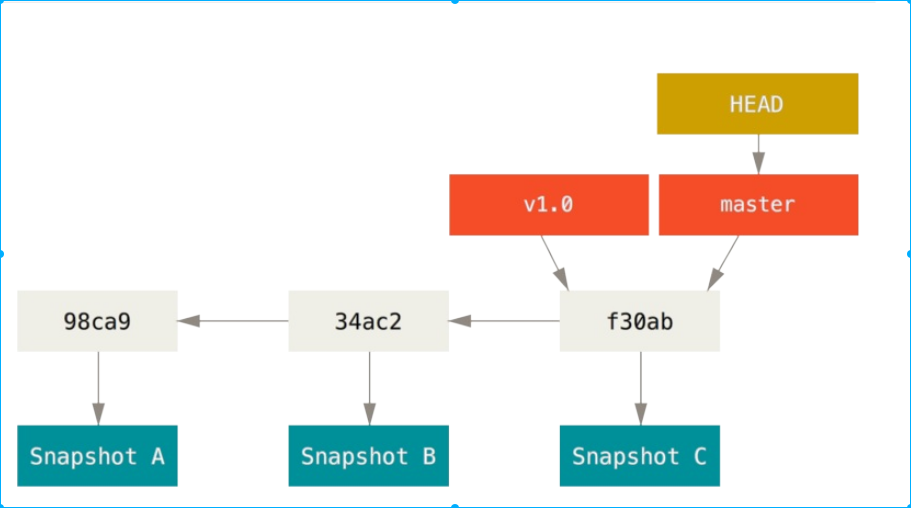

# git 学习随笔

## 基本概念

git 对待数据类似快照流的形式而不是类似 cvs 那样的纪录文件随时间逐步积累的差异

git 中所有数据在存储钱都会计算校验和（hash)

三种状态：已提交(committed)，已修改(modified)，已暂存(staged)。

add 命令代表“添加内容到下一次提交中”，而不是“将一个文件添加到项目中”

.gitignore 格式规范如下:

- 所有空行或者以#开头的行都会被 Git 忽略。
- 可以使用标准的 glob 模式匹配。
- 匹配模式可以以( / )开头防止递归。
- 匹配模式可以以( / )结尾指定目录。
- 要忽略指定模式以外的文件或目录,可以在模式前加上惊叹号(!)取反。

glob 模式是指 shell 使用的简化了的正则表达式。星号匹配零个或多个任意字符；[abc]匹配任何列在方括号中的字符；问号之匹配一个任意字符；如果在方括号中使用短划线分割两个字符，表示在这两个字符范围内都可以匹配，例如[0-9]。使用型号表示匹配任意中间目录，比如 a/\*\*/z 可以匹配 a/z,a/b/z 等等

gitignore 有一套针对多种语言的模板库[https://github.com/github/gitignore](https://github.com/github/gitignore)

git diff 本身只显示尚未暂存的改动,而不是自上次提交以来所做的所有改动

提交时记录的是放在暂存区域的快照.任何还未暂存的仍然保持已修改状态,可以
在下次提交时纳入版本管理。 每一次运行提交操作,都是对你项目作一次快照,以后可以回到这个状态,或者进行比较。

git log -p 显示代码变化， --stat 显示文件变化

分支本质上仅仅是指向提交对象的可变指针，每次提交操作中自动向前移动。而创建分支，也就是新建一个指针。HEAD 是一个特殊的指针，指向当前分支。

