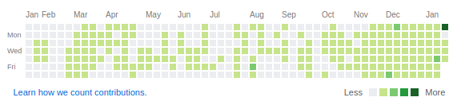

赶在还没过 2019 农历新年的时候，终于完成了[博客](https://www.zido.site)的更新升级，本来想着 2018 年的十二月末尾做年度总结来着，但是发现 gatsby 已经升级到了 2.x。本着用新不用旧的原则，花了一个月的时间，完全重构的博客。虽然总体而言界面差别不大来着，不过安装依赖的时候没有那一堆警告，看着也挺爽的 2333。

> 没有 2017 的年度总结，当时觉得实在是大失败，没有任何东西好写的，就只是默默地做了下简单的规划。想着今年一定不能落下了，即使是晚了，我也还是应该发出来警醒自己

# 关于编程思想的转变

今年莫名其妙有种灵魂升华的感觉

首先，在我自己凭着兴趣学了几门语言之后，感觉其实各大语言都基本大同小异，各有所长，没有能真正通吃的语言，**即使是 js**。偏向具体领域型的语言应该会更加受欢迎。没必要为语言的优劣而争执，喜欢就喜欢，不喜欢也不必贬低，毕竟**编程语言只是实现想法的工具**。

其次，在自己尝试着做一些框架层面的代码或者说看了各种框架源代码之后，觉得慢慢变得能开始跟上任何一个框架的设计者的思路，一些简单的东西能够开始凭借着经验看（<del>懵</del>）出大致的设计思路，还能大概想出来也许会有某个坑，然后兴高采烈的去验证验证，如果有，那么为自己的猜想正确而沾沾自喜，如果没有，就会查看源代码，看看作者的思路，如何去解决这些问题，也得到了许多知识，有种拨开云雾见青天的感觉。

最后，也是我一直在反省的问题，那就是知识深度的问题，知识面变广很容易，难的是如何变深。所以在今年的学习中，主要是以深度为主，除了部分 go 语言的东西外，基本真正学得比较深的东西都全部被自己强行限定在了 java 范畴，即使有其他东西能够吸引我，也没有去花太多精力了解。而是一直在深耕 java，这条路不知道对不对，但是我乐在其中。

# 学习、阅读情况

今年的学习总体上是到处埋坑。

代码上一般结合源码一起边学习边创造的状态，整体进度很慢，不过胜在印象深刻。

理论知识主要来源是书籍。

还有感谢黑客派社区里丰富的干货知识。扫了我很多的知识盲区

## java ee 方向

今年对 java 的语言层面的学习还是比较多的，一方面是为了复习基础，另一方面向更深层次扩展。复习的主要方向是 io 和多线程。主要阅读书籍是《java 核心技术卷二》，完完整整的看完，然后做为工具书，偶尔翻阅为主。在多线程方面，主要通过《java 并发编程实战》学习，这本书虽然很薄，但是确实是结结实实的干货，质量完全有保证，因为看得比较细致，而且下半年主要的东西还是写开源项目，就还没有把整本书看完，只看了一半多，就暂时丢在一旁，实战方面接触挺少，相关业务太少，只能偶尔炫技装逼用。

然后是对于整体 java ee 的复习（预习）。买了几本书，大多数是国人所写，例如《java ee 开发的颠覆者 springboot 实战》、《spring cloud 与 Docker 微服务实战》等。对于书籍好坏不太好评价，但是个人觉得可能对我而言帮助挺小的，基本都是草草过一遍，收获不大。真正让我觉得非常用心，收获巨大的书籍是近期才购买并阅读的《深入分析 java web 技术内幕》，阿里技术丛书之一，一章章的干货，都是曾经面试被虐的素材，简直像是一个一个面试重新摆在面前一样，讲解深入细致，值得推荐。目前看到第七章。

jdk源码方面： 开始接触一部分的jdk源码实现，跨度挺大，没有特别关注的领域，大致包含 各种基本数据类型的包装类、一部分容器类、一部分concurrent包、一部分io包。之后应该会找时间一个一个的写博文记录下来（毕竟博客才重构好。。。得慢慢来）。

一些其他书籍：

- 《大话设计模式》，絮絮叨叨没啥干货，被拿来垫桌子了，它还有个难兄难弟《大话数据结构》，其实还不错，最后命运差不多，垫了显示器。
-  《java 编程思想》、《代码大全》、《高性能mysql》太厚，看不进去。
- 《深入理解java虚拟机》，因为确实接触场景太少了，看了一部分之后就被暂时存档了。

当前状态：能大概简述部分jdk源码实现，能适应多线程编程场景，不至于看不懂多线程代码。对jvm大体架构有所认识。对整个http服务有一定的理解，能进行部分调优。对于分布式，能够使用spring cloud全家桶开发，但还是不了解分布式（早就想了解了，一直没有场景，非常遗憾）。

之后： 紧紧围绕《java 并发编程实战》、《深入分析 java web 技术内幕》两本书结合各类源码深入挖掘java及web开发。

## 算法刷题

可能真的对算法没什么天分，先是在leetcode上被一道道中级题目虐，之后换到codewars上。当开始给我推4kyu的题目时就开始刚不出来了。大致上做5-8kyu还行。

也确实挺少时间做题来着，不过做不出来也是真的（哭

> 感觉在这些网站上做题和以前在学校做acm题不一样，命名acm有套路来着。。。

当前状态：codewars(16)

之后：计划一年时间能刷到100题

## 前端方向

今年对前端的学习较于前两年明显的减少了，只是了解了react16.x和typescript以及为了做博客而学习gatsby。

书籍方面，也只是再次回味了一遍《javascript高级程序设计》。因为基本已经确定不再花太多时间在前端方向，能用就行，主要精力完全放在后端。

当前状态：能用react/vue进行开发。

之后：停止

## 框架学习

### http-client

主要是公司有爬虫需求，然后就是边学边写，看源码，学习一下框架的编写思路（顺便一提，这份源码为我自己尝试编写[爬虫框架](https://github.com/zidoshare/Elise)提供了很多很多的帮助，整体代码结构也进行了模仿）。

当前状态：目前处于能看懂 httpclient 的执行流程和整体架构，但是对于一些深层次的的东西还没有细摸，主要是觉得使用场景越来越少，没有太大的必要了，我需要的是学习这个框架对于 http 协议的处理以及代码结构即可，属于浅尝辄止。

之后：停止

### spring

毫无疑问，这是重中之重，凭着半吊子英文水平一直努力的在看官方文档，做记录，不过因为前面博客一直没有重构完成，也就一直没有更新相关博文，后续找时间补上。官方文档太多太长，英语水平太差，看得很慢，不过还得再努力坚持坚持，至于为什么不看中文？首先是希望能锻炼英语阅读水平，其次可能是上次被某翻译坑怕了。。。

对于一些组件的运行原理有着简单的了解，例如 spring mvc、spring session、spring data jpa（hibernate）等等，其中接触最多的是 mvc，不过感觉最复杂的也是这玩意儿来着。

当前状态：应付日常基本没啥问题，偶尔通过调调代码也能找到问题所有，基本了解 spring 的设计理念和项目结构。

之后：继续深入，计划把 asm 了解之后把研究方向向一些其他的基础组件的运行原理方向发展。

### 其他的小框架

自己因为做爬虫框架[Elise](https://github.com/zidoshare/Elise)而看的一些开源爬虫框架代码,这些代码基本是源码过完：

- colly:go 语言的爬虫框架，代码挺不错的，干净易懂，也是给我自己写框架提供了不少的思路
- webmagic:java 的开源爬虫框架，老牌框架了，稳定方便，我自己本身最开始是直接基于此框架改的，但是看了看协议，貌似有所侵犯，所以全部重构一次，应该不涉及侵权了吧
- Spiderman2: 不错的框架,目前使用的 xpath 解析器就是使用的这个框架的，也属于代码浅显易懂
- google/xml-path: google 的 xpath 解析器，老实说...没看懂

为了尝试做 markdown 编辑器看的代码：

- remarked: markdown 解析器，代码结构易懂，正则挺复杂的。
- Remarkable: 又一款 markdown 解析器，比 remarked 要大，但是代码结构更清楚易懂。

另外是还有其他的框架，主要是偶尔学习的时候，想了解某部分原理，看大框架太累而找的一些小框架看：

- smart-framework:web 框架，麻雀虽小五脏俱全，做为写 web 框架的学习代码简直舒服得不要不要的。

...其他暂时不太知名的就略过了，基本都是在 github 上翻的各类相关框架代码，收获颇丰

# 关于开源

上半年，迷迷糊糊，有时看会书，有时又会沉迷游戏，可能确实是现在的公司空闲时间挺多，人懒下来了。
上半年在 github 上开了许多的坑，基本都是前端项目：

[react 的多页脚手架](github.com/zidoshare/react-multiple-pages-starter)（可以用，但是没必要）。

[react 服务端渲染脚手架](https://github.com/zidoshare/react-ssr-starter)(可以用，但依然没必要)

后端学习性质的尝试做了做[web 框架](https://github.com/zidoshare/bone)（只完成了 ioc 就感觉复杂度实在太高水平有限，暂时弃掉，后续**一定**会尝试再做起来），主要是为了验证自己的一些想法

上半年基本上是一个学习+验证循环的过程，处于边学边做的状态，基本上是属于一次次代码学习探索的存档，当然其实还有其他坑，不多谈，没必要。

下半年有所改善，我一直很喜欢做开源，即使再忙基本都会强迫症式的尽可能抽出时间来写点代码。开了一个决定一直做下去的[坑](https://github.com/zidoshare/Elise)，磕磕碰碰坐了半年，开始慢慢有点样子，虽然最近因为改版[博客](https://github.com/zidoshare/curly-succotash)的缘故暂时没写了，不过接下来会重新拿起来继续坚持做下去。

# 最后

新的一年，新的开始，继续开开心心的搞事情。计划在下半年能有一个不错的收获（指工作）。

大家过个好年，开开心心迎接新年。

最后附上自己的2018的github提交图，真实地反映了我的现状。。。

