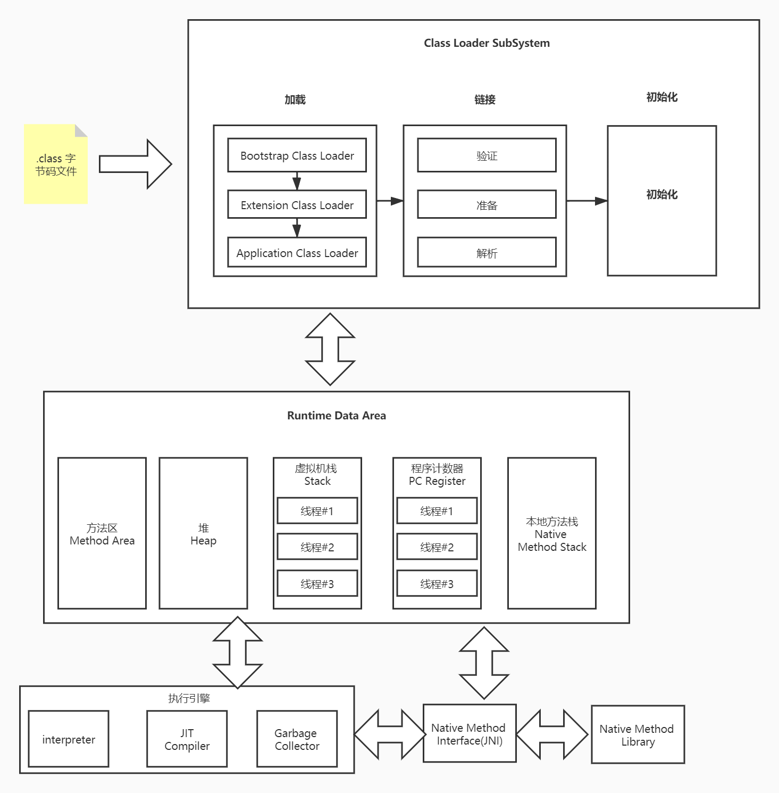
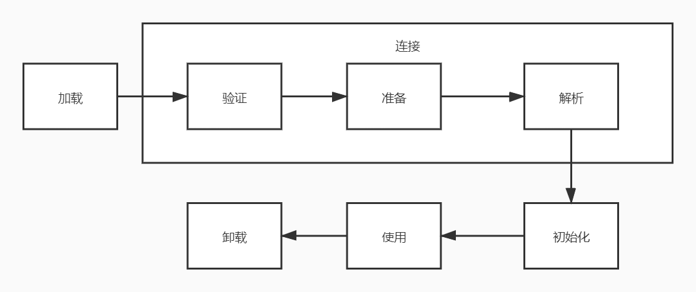

# Java虚拟机

在了解类加载之前，首先应该了解java虚拟机的作用:

java虚拟机（java virtual machine,JVM），是一种能够运行java字节码的虚拟机。作为一种编程语言的虚拟机，实际上不只是用于java语言，只要生成的编译文件匹配JVM对加载编译文件格式的要求，任何语言都可以有JVM编译运行。比如Kotlin、scala、groovy等。。

## JVM 的基本结构

JVM主要有三个子系统构成

* 类加载子系统
* 运行时数据区(内存结构)
* 执行引擎

我们可以通过下图查看整个架构设计


其中第一步，则是本文讲解的类加载系统。

# 类加载系统

## 类的生命周期



加载过程中，大概可以分为三个阶段

* 加载： 找到.class文件（文件目录，网络url等），加载完成之后并不会立即放到jvm内存中。
* 连接： 
    * 校验：校验.class文件，例如元数据结构、字节码的正确性，确保.class文件符合jvm规范
    * 准备： 为类的静态变量分配存储空间并赋予默认值，比如为int类型分配好4个字节，默认赋予0
    * 解析： 将符号引用转成直接引用，类装载器装入类所引用的其他所有类（静态链接）
* 初始化：对类的静态变量，静态代码块执行初始化操作,此时才会为静态变量真正赋予编写者赋予的值

# 类加载器

> 要确定一个类是唯一的，需要两个条件： 类的全限定名 和 类加载器。


* 启动类加载器(Bootstrap ClassLoader): 负责加载JRE的核心类库，比如JRE目录下的rt.jar,charsets.jar等。
* 扩展类加载器(Extension ClassLoader): 负责加载JRE扩展目录(ext)下的类包
* 系统类加载器(Application ClassLoader): 负责加载ClassPath路径下的类包
* 用户自定义加载器(User ClassLoader): 负责加载用户自定义路径下的类包


实际上类加载器并不复杂，一般而言，就简单的根据加载目录不同进行区分就行了。

我们可以通过如下代码来查看Bootstrap ClassLoader从哪些地方加载了相关的jar或class文件：

```java
public void getBootstrapClassLoaderLocations() {
    URL[] urLs = sun.misc.Launcher.getBootstrapClassPath().getURLs();
    for (URL urL : urLs) {
        System.out.println(urL.toExternalForm());
    }
}
```

输出如下：

```
file:/C:/Program%20Files/Java/jdk1.8.0_231/jre/lib/resources.jar

file:/C:/Program%20Files/Java/jdk1.8.0_231/jre/lib/rt.jar

file:/C:/Program%20Files/Java/jdk1.8.0_231/jre/lib/sunrsasign.jar

file:/C:/Program%20Files/Java/jdk1.8.0_231/jre/lib/jsse.jar

file:/C:/Program%20Files/Java/jdk1.8.0_231/jre/lib/jce.jar

file:/C:/Program%20Files/Java/jdk1.8.0_231/jre/lib/charsets.jar

file:/C:/Program%20Files/Java/jdk1.8.0_231/jre/lib/jfr.jar

file:/C:/Program%20Files/Java/jdk1.8.0_231/jre/classes
```

查看以下案例：

```java
import com.sun.crypto.provider.DESKeyFactory;

import java.util.Map;

public class Demo {
    public static void main(String[] args) {
        System.out.println(Map.class.getClassLoader());
        System.out.println(DESKeyFactory.class.getClassLoader());
        System.out.println(Demo.class.getClassLoader());
    }
}

```

运行得到以下结果：

```
null
sun.misc.Launcher$ExtClassLoader@7d4991ad
sun.misc.Launcher$AppClassLoader@73d16e93
```

可以观察到，DESKeyFacotry是使用ExtClassLoader进行加载的，Demo使用AppClassLoader，分别对应了扩展类加载器和系统类加载器，但是Map的类加载器打印出来却是null，为什么呢？

实际上null是正常情况，因为Bootstrap ClassLoader是使用原生代码实现的。


## 双亲委派机制

双亲委派机制其实是一种翻译错误，我们查看Java Api中的[Understanding Extension Class Loading](https://docs.oracle.com/javase/tutorial/ext/basics/load.html)章节，可以看到：

> The Java platform uses a delegation model for loading classes. The basic idea is that every class loader has a "parent" class loader. When loading a class, a class loader first "delegates" the search for the class to its parent class loader before attempting to find the class itself.

事实上，这是一种委托机制，不要再去抠所谓双亲，而是应该考虑为父类委派。同时要注意这里的父类**不是**继承关系，而只是一种父子关系，每个类加载器都有一个父类加载器，加载类的过程如下：

* 类加载器首先会判断自己是否有父类加载器
* 如果有，就直接交给父类加载器（每一层都会如此）
* 如果没有，则执行加载，但是呢，每个加载器会有自己的职责，它又需要判断，自己此类是否是自己的类加载器所在的路径
* 如果是，则执行加载
* 否则让子加载器尝试加载类。

双亲委派模型是如此的简单，并且，在jdk中的实现也是非常简单的：

```java
//ClassLoader.java
protected Class<?> loadClass(String name, boolean resolve)
        throws ClassNotFoundException
{
    synchronized (getClassLoadingLock(name)) {
        // First, check if the class has already been loaded
        Class<?> c = findLoadedClass(name);
        if (c == null) {
            long t0 = System.nanoTime();
            try {
              //如果有父加载器，则使用父加载器加载，否则，自行加载，就几句代码就实现了
                if (parent != null) {
                    c = parent.loadClass(name, false);
                } else {
                    c = findBootstrapClassOrNull(name);
                }
            } catch (ClassNotFoundException e) {
                // ClassNotFoundException thrown if class not found
                // from the non-null parent class loader
            }

            if (c == null) {
                // If still not found, then invoke findClass in order
                // to find the class.
                long t1 = System.nanoTime();
                c = findClass(name);

                // this is the defining class loader; record the stats
                sun.misc.PerfCounter.getParentDelegationTime().addTime(t1 - t0);
                sun.misc.PerfCounter.getFindClassTime().addElapsedTimeFrom(t1);
                sun.misc.PerfCounter.getFindClasses().increment();
            }
        }
        if (resolve) {
            resolveClass(c);
        }
        return c;
    }
}
```

那么，为什么要有双亲委派机制呢？

* 防止重复加载，因为每次都会依次向父类加载器问一下，是否加载过了，保证不会重复加载
* 保证核心的`.class`文件不会被篡改。举个例子，用户（特别是攻击者）自行定义一个`java.lang.String`类，此时如果没有双亲委派机制，那么此String类就会被成功加载到JVM中，从而导致真正的String类被覆盖。而有了双亲委派，自定义的String类就不会加载到内存，因为首先是最顶端的类加载器**通过包名**加载了`java.lang.String`类，自定义的String类无法加载。但是这时候如果我们自定义类加载器打破双亲委派，不去调用父加载器呢？这完全不需要担心，自行加载的String类并不会被其他类库调用，它根本和`java.lang.String`不是一个类了，请看类加载器介绍的第一句话：**要确定一个类是唯一的，需要两个条件： 类的全限定名 和 类加载器。**。

