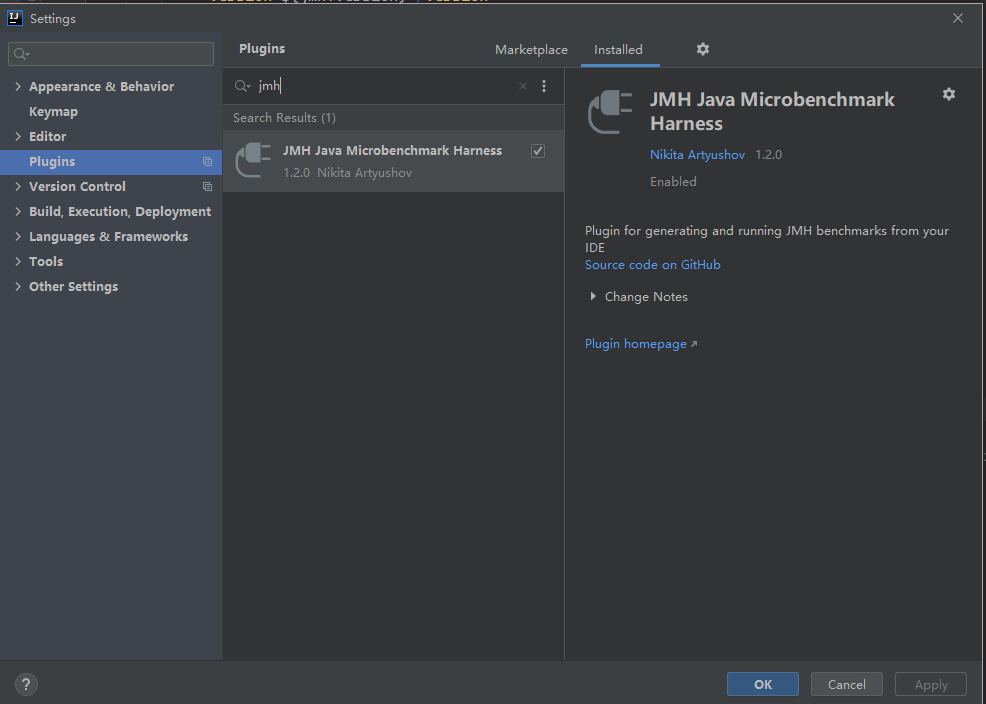
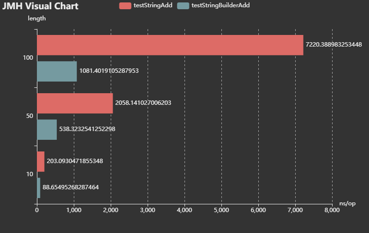

# JMH 简单使用说明
## 基准测试简介
### 什么是基准测试
基准测试是指通过设计科学的测试方法、测试工具和测试系统，实现对一类测试对象的某项性能指标进行定量的和可对比的测试。

现代软件常常都把高性能作为目标。那么，何为高性能，性能就是快，更快吗？显然，如果没有一个量化的标准，难以衡量性能的好坏。

不同的基准测试其具体内容和范围也存在很大的不同。如果是专业的性能工程师，更加熟悉的可能是类似SPEC提供的工业标准的系统级测试；而对于大多数 Java 开发者，更熟悉的则是范围相对较小、关注点更加细节的微基准测试（Micro-Benchmark）。何谓 Micro Benchmark 呢？ 简单地说就是在 method 层面上的 benchmark，精度可以精确到 微秒级。

### 何时需要微基准测试
微基准测试大多是 API 级别的性能测试。

微基准测试的适用场景：

* 如果开发公共类库、中间件，会被其他模块经常调用的 API。
* 对于性能，如响应延迟、吞吐量有严格要求的核心 API。

# JMH 简介
JMH(即 Java Microbenchmark Harness) (opens new window)，是目前主流的微基准测试框架。JMH 是由 Hotspot JVM 团队专家开发的，除了支持完整的基准测试过程，包括预热、运行、统计和报告等，还支持 Java 和其他 JVM 语言。更重要的是，它针对 Hotspot JVM 提供了各种特性，以保证基准测试的正确性，整体准确性大大优于其他框架，并且，JMH 还提供了用近乎白盒的方式进行 Profiling 等工作的能力。

## 为什么需要 JMH
### 死码消除
所谓死码，是指注释的代码，不可达的代码块，可达但不被使用的代码等等 。

#### 常量折叠与常量传播
常量折叠 (opens new window)(Constant folding) 是一个在编译时期简化常数的一个过程，常数在表示式中仅仅代表一个简单的数值，就像是整数 2，若是一个变数从未被修改也可作为常数，或者直接将一个变数被明确地被标注为常数，例如下面的描述：

## JMH 的注意点
* 测试前需要预热。
* 防止无用代码进入测试方法中。
* 并发测试。
* 测试结果呈现。

## 应用场景
1. 当你已经找出了热点函数，而需要对热点函数进行进一步的优化时，就可以使用 JMH 对优化的效果进行定量的分析。
2. 想定量地知道某个函数需要执行多长时间，以及执行时间和输入 n 的相关性
3. 一个函数有两种不同实现（例如 JSON 序列化/反序列化有 Jackson 和 Gson 实现），不知道哪种实现性能更好
## JMH 概念
* Iteration - iteration 是 JMH 进行测试的最小单位，包含一组 invocations。
* Invocation - 一次 benchmark 方法调用。
* Operation - benchmark 方法中，被测量操作的执行。如果被测试的操作在 benchmark 方法中循环执行，可以使用@OperationsPerInvocation表明循环次数，使测试结果为单次 operation 的性能。
* Warmup - 在实际进行 benchmark 前先进行预热。因为某个函数被调用多次之后，JIT 会对其进行编译，通过预热可以使测量结果更加接近真实情况。
# JMH 快速入门
# 添加 maven 依赖
```xml
<dependency>
    <groupId>org.openjdk.jmh</groupId>
    <artifactId>jmh-core</artifactId>
    <version>${jmh.version}</version>
</dependency>
<dependency>
    <groupId>org.openjdk.jmh</groupId>
    <artifactId>jmh-generator-annprocess</artifactId>
    <version>${jmh.version}</version>
    <scope>provided</scope>
</dependency>
```
## 测试代码
```java
import org.openjdk.jmh.annotations.*;
import org.openjdk.jmh.runner.*;

import java.util.concurrent.TimeUnit;

@BenchmarkMode(Mode.Throughput)
@Warmup(iterations = 3)
@Measurement(iterations = 10, time = 5, timeUnit = TimeUnit.SECONDS)
@Threads(8)
@Fork(2)
@OutputTimeUnit(TimeUnit.MILLISECONDS)
public class StringBuilderBenchmark {

    @Benchmark
    public void testStringAdd() {
        String a = "";
        for (int i = 0; i < 10; i++) {
            a += i;
        }
        // System.out.println(a);
    }

    @Benchmark
    public void testStringBuilderAdd() {
        StringBuilder sb = new StringBuilder();
        for (int i = 0; i < 10; i++) {
            sb.append(i);
        }
        // System.out.println(sb.toString());
    }

    public static void main(String[] args) throws RunnerException {
        Options options = new OptionsBuilder()
            .include(StringBuilderBenchmark.class.getSimpleName())
            .output("d:/Benchmark.log")
            .build();
        new Runner(options).run();
    }

}
```
## 执行 JMH
### 命令行
（1）初始化 benchmarking 工程

    $ mvn archetype:generate \
            -DinteractiveMode=false \
            -DarchetypeGroupId=org.openjdk.jmh \
            -DarchetypeArtifactId=jmh-java-benchmark-archetype \
            -DgroupId=org.sample \
            -DartifactId=test \
            -Dversion=1.0
（2）构建 benchmark

    cd test/
    mvn clean install
（3）运行 benchmark
    java -jar target/benchmarks.jar

### JMH结果解析

    # JMH version: 1.29
    # VM version: JDK 1.8.0_131, Java HotSpot(TM) 64-Bit Server VM, 25.131-b11
    # VM invoker: C:\Program Files\Java\jdk1.8.0_131\jre\bin\java.exe
    # VM options: -javaagent:D:\softwares\JetBrains\apps\IDEA-U\ch-0\203.7717.56\lib\idea_rt.jar=52459:D:\softwares\JetBrains\apps\IDEA-U\ch-0\203.7717.56\bin -Dfile.encoding=UTF-8
    # Blackhole mode: full + dont-inline hint
    # Warmup: 3 iterations, 1 s each
    # Measurement: 5 iterations, 5 s each
    # Timeout: 10 min per iteration
    # Threads: 4 threads, will synchronize iterations
    # Benchmark mode: Average time, time/op
    # Benchmark: site.zido.demo.StringBuilderBenchmark.testStringAdd
    # Parameters: (length = 10)

该部分为测试的基本信息，比如使用的 Java 路径，预热代码的迭代次数，测量代码的迭代次数，使用的线程数量，测试的统计单位等。

    # Run progress: 0.00% complete, ETA 00:02:48
    # Fork: 1 of 1
    # Warmup Iteration   1: 298.784 ±(99.9%) 53.475 ns/op
    # Warmup Iteration   2: 200.907 ±(99.9%) 18.746 ns/op
    # Warmup Iteration   3: 199.246 ±(99.9%) 20.066 ns/op

该部分为每一次热身中的性能指标，预热测试不会作为最终的统计结果。预热的目的是让 JVM 对被测代码进行足够多的优化，比如，在预热后，被测代码应该得到了充分的 JIT 编译和优化。

    Iteration   1: 199.487 ±(99.9%) 12.065 ns/op
    Iteration   2: 207.219 ±(99.9%) 5.982 ns/op
    Iteration   3: 202.642 ±(99.9%) 3.665 ns/op
    Iteration   4: 202.046 ±(99.9%) 10.909 ns/op
    Iteration   5: 204.071 ±(99.9%) 3.886 ns/op


    Result "site.zido.demo.StringBuilderBenchmark.testStringAdd":
      203.093 ±(99.9%) 10.939 ns/op [Average]
      (min, avg, max) = (199.487, 203.093, 207.219), stdev = 2.841
      CI (99.9%): [192.154, 214.032] (assumes normal distribution)

该部分显示测量迭代的情况，每一次迭代都显示了当前的执行速率，即一个操作所花费的时间。在进行 5 次迭代后，进行统计，在本例中，length 为 100 的情况下 testStringBuilderAdd 方法的平均执行花费时间为 203.093 ns，误差为 10.939 ns。

最后的测试结果如下所示：

    Benchmark                                    (length)  Mode  Cnt     Score     Error  Units
    StringBuilderBenchmark.testStringAdd               10  avgt    5   203.093 ±  10.939  ns/op
    StringBuilderBenchmark.testStringAdd               50  avgt    5  2058.141 ± 264.359  ns/op
    StringBuilderBenchmark.testStringAdd              100  avgt    5  7220.389 ± 229.006  ns/op
    StringBuilderBenchmark.testStringBuilderAdd        10  avgt    5    88.655 ±   6.950  ns/op
    StringBuilderBenchmark.testStringBuilderAdd        50  avgt    5   538.323 ±  11.762  ns/op
    StringBuilderBenchmark.testStringBuilderAdd       100  avgt    5  1081.402 ±  26.924  ns/op

结果表明，在拼接字符次数越多的情况下，StringBuilder.append() 的性能就更好。\

### 生成jar包

对于一些小测试，直接用上面的方式写一个 main 函数手动执行就好了。

对于大型的测试，需要测试的时间比较久、线程数比较多，加上测试的服务器需要，一般要放在 Linux 服务器里去执行。

JMH 官方提供了生成 jar 包的方式来执行，我们需要在 maven 里增加一个 plugin，具体配置如下：
```xml
<build>
    <plugins>
        <plugin>
            <groupId>org.apache.maven.plugins</groupId>
            <artifactId>maven-shade-plugin</artifactId>
            <version>3.2.4</version>
            <executions>
                <execution>
                    <phase>package</phase>
                    <goals>
                        <goal>shade</goal>
                    </goals>
                    <configuration>
                        <finalName>jmh-demo</finalName>
                        <transformers>
                            <transformer
                                    implementation="org.apache.maven.plugins.shade.resource.ManifestResourceTransformer">
                                <mainClass>site.zido.demo.StringBuilderBenchmark</mainClass>
                            </transformer>
                        </transformers>
                    </configuration>
                </execution>
            </executions>
        </plugin>
    </plugins>
</build>
```

# JMH API
下面来了解一下 jmh 常用 API

## @BenchmarkMode
基准测试类型。这里选择的是 Throughput 也就是吞吐量。根据源码点进去，每种类型后面都有对应的解释，比较好理解，吞吐量会得到单位时间内可以进行的操作数。

* Throughput - 整体吞吐量，例如“1 秒内可以执行多少次调用”。
* AverageTime - 调用的平均时间，例如“每次调用平均耗时 xxx 毫秒”。
* SampleTime - 随机取样，最后输出取样结果的分布，例如“99%的调用在 xxx 毫秒以内，99.99%的调用在 xxx 毫秒以内”
* SingleShotTime - 以上模式都是默认一次 iteration 是 1s，唯有 SingleShotTime 是只运行一次。往往同时把 warmup 次数设为 0，用于测试冷启动时的性能。
* All - 所有模式
## @Warmup
上面我们提到了，进行基准测试前需要进行预热。一般我们前几次进行程序测试的时候都会比较慢， 所以要让程序进行几轮预热，保证测试的准确性。其中的参数 iterations 也就非常好理解了，就是预热轮数。

为什么需要预热？因为 JVM 的 JIT 机制的存在，如果某个函数被调用多次之后，JVM 会尝试将其编译成为机器码从而提高执行速度。所以为了让 benchmark 的结果更加接近真实情况就需要进行预热。

## @Measurement
度量，其实就是一些基本的测试参数。

* iterations - 进行测试的轮次
* time - 每轮进行的时长
* timeUnit - 时长单位
都是一些基本的参数，可以根据具体情况调整。一般比较重的东西可以进行大量的测试，放到服务器上运行。

## @Threads
每个进程中的测试线程，这个非常好理解，根据具体情况选择，一般为 cpu 乘以 2。

## @Fork
进行 fork 的次数。如果 fork 数是 2 的话，则 JMH 会 fork 出两个进程来进行测试。

## @OutputTimeUnit
这个比较简单了，基准测试结果的时间类型。一般选择秒、毫秒、微秒。

## @Benchmark
方法级注解，表示该方法是需要进行 benchmark 的对象，用法和 JUnit 的 @Test 类似。

## @Param
属性级注解，@Param 可以用来指定某项参数的多种情况。特别适合用来测试一个函数在不同的参数输入的情况下的性能。

## @Setup
方法级注解，这个注解的作用就是我们需要在测试之前进行一些准备工作，比如对一些数据的初始化之类的。

## @TearDown
方法级注解，这个注解的作用就是我们需要在测试之后进行一些结束工作，比如关闭线程池，数据库连接等的，主要用于资源的回收等。

## @State
当使用 @Setup 参数的时候，必须在类上加这个参数，不然会提示无法运行。

State 用于声明某个类是一个“状态”，然后接受一个 Scope 参数用来表示该状态的共享范围。 因为很多 benchmark 会需要一些表示状态的类，JMH 允许你把这些类以依赖注入的方式注入到 benchmark 函数里。Scope 主要分为三种。

* Thread - 该状态为每个线程独享。
* Group - 该状态为同一个组里面所有线程共享。
* Benchmark - 该状态在所有线程间共享。
关于 State 的用法，官方的 code sample 里有比较好的[例子](http://hg.openjdk.java.net/code-tools/jmh/file/cb9aa824b55a/jmh-samples/src/main/java/org/openjdk/jmh/samples/JMHSample_03_States.java)。

# JMH陷阱

在使用 JMH 的过程中，一定要避免一些陷阱。

比如 JIT 优化中的死码消除，比如以下代码：
```java
@Benchmark
public void testStringAdd(Blackhole blackhole) {
    String a = "";
    for (int i = 0; i < length; i++) {
        a += i;
    }
}
```

JVM 可能会认为变量 a 从来没有使用过，从而进行优化把整个方法内部代码移除掉，这就会影响测试结果。

JMH 提供了两种方式避免这种问题，一种是将这个变量作为方法返回值 return a，一种是通过 Blackhole 的 consume 来避免 JIT 的优化消除。

其他陷阱还有常量折叠与常量传播、永远不要在测试中写循环、使用 Fork 隔离多个测试方法、方法内联、伪共享与缓存行、分支预测、多线程测试等，感兴趣的可以阅读 [https://github.com/lexburner/JMH-samples](https://github.com/lexburner/JMH-samples) 了解全部的陷阱。

# JMH 插件

可以通过 IDEA 安装 JMH 插件使 JMH 更容易实现基准测试，在 IDEA 中点击 File->Settings...->Plugins，然后搜索 jmh，选择安装 `JMH Java Microbenchmark Harness`：


这个插件可以让我们能够以 JUnit 相同的方式使用 JMH，主要功能如下：

* 自动生成带有 @Benchmark 的方法
* 像 JUnit 一样，运行单独的 Benchmark 方法
* 运行类中所有的 Benchmark 方法

比如可以通过右键点击 Generate...，选择操作 Generate JMH benchmark 就可以生成一个带有 @Benchmark 的方法。

还有将光标移动到方法声明并调用 Run 操作就运行一个单独的 Benchmark 方法。

将光标移到类名所在行，右键点击 Run 运行，该类下的所有被 @Benchmark 注解的方法都会被执行。

# JMH 可视化

除此以外，如果你想将测试结果以图表的形式可视化，可以试下这些网站：

* JMH Visual Chart： [http://deepoove.com/jmh-visual-chart/](http://deepoove.com/jmh-visual-chart/)
* JMH Visualizer： [https://jmh.morethan.io/](https://jmh.morethan.io/)
比如将上面测试例子结果的 json 文件导入，就可以实现可视化：



# 参考链接

* [JMH 官方文档](http://openjdk.java.net/projects/code-tools/jmh/)
* [JMH 应用指南](https://dunwu.github.io/javatech/test/jmh.html)
* [性能调优必备利器之 JMH](https://www.cnblogs.com/wupeixuan/p/13091381.html)