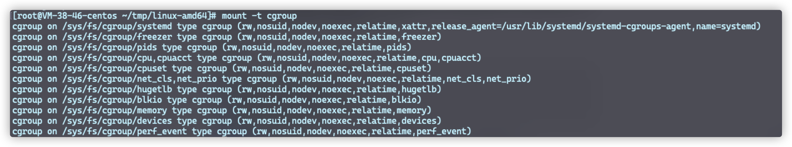
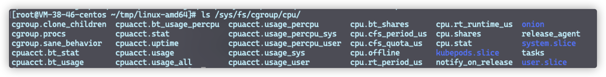

# NameSpace-文件系统隔离

Linux 从2.4.19开始陆续引入`namespace`的概念。它将全局系统的资源包裹在一个抽象层中，使得在每个 namespace 内部的进程看起来自己都拥有一个独立的全局资源。同一个 namespace 下的资源变化对于同一 namespace 的进程是可见的，但是对于不同namespace下的进程是不可见的。

Linux 可用的 namespace 如下：

* Cgroup：隔离 cgroupns root 和 cgroup filesystem视图。（Cgroup隔离）
* IPC：隔离 System V IPC 和 POSIX 消息队列。（进程间通信）
* Network：隔离网络设备、栈、端口等。（虚拟网络）
* Mount PID： 挂载点（虚拟文件系统）
* PID：进程 ID（独立进程ID，比如可以拥有独立的1进程）
* User：用户和用户组
* UTS：Hostname 和 NIS域名

通过这一系列的 namespace 从而建立起单独的文件系统、进程、用户、网络等。

而`docker run` 命令中也有单独的参数进行配置

```
--cgroupns string Cgroup namespace to use (host|private)
--ipc string IPC namespace to use
--pid string PID namespace to use
--userns string User namespace to use
--uts string UTS namespace to use
```

通过指定这些参数，可以强制容器运行在特定的 namespace 中。

namespace 相关的主要有三个系统调用 api：
* clone：创建一个命名空间，调用后会创建一个新的进程。
* setns：关联一个存在命名空间。
* unshare：类似 clone，但主要作用于调用的进程。

# Cgroups-资源限制

通过 namespace 实现了资源隔离之后，每个容器都相当于有了自己的环境，但是仍有存在不足，那就是 cpu、内存等资源的使用不受限制。然而很明显，为了能够让容器不占用其它容器的资源（或者说确定每个容器的”硬件“配置），我们得需要其它的策略来达到这一目的，而这，就是 Cgroups。

cgroups 的全称是control groups，是Linux内核提供的一种可以限制单个进程或者多个进程所使用资源的机制，可以对 cpu，内存等资源实现精细化的控制。它为每种可以控制的资源定义了一个子系统，如下：

1. cpu 子系统，主要限制进程的 cpu 使用率。
2. cpuacct 子系统，可以统计 cgroups 中的进程的 cpu 使用报告。
3. cpuset 子系统，可以为 cgroups 中的进程分配单独的 cpu 节点或者内存节点。
4. memory 子系统，可以限制进程的 memory 使用量。
5. devices 子系统，可以控制进程能够访问某些设备。
6. freezer 子系统，可以挂起或者恢复 cgroups 中的进程。
7. net_cls 子系统，可以标记 cgroups 中进程的网络数据包，然后可以使用 tc 模块（traffic control）对数据包进行控制。
8. blkio 子系统，可以限制进程的块设备 io。
9. pref_event 子系统，Cgroups中的进程监控。
10. net_prio 子系统，Cgroups中的网络优先级。
11. hugetlb 子系统，巨页（大内存页）限制。
12. pids 子系统，进程数量限制。
13. rdma 子系统，限制 RDMA/IB 特殊资源使用。

注意，cgroups 并不是一组系统调用，而是实现为了文件系统，可以通过 `mount -t cgroup` 查看

在我的 tlinux(CentOS7) 下显示如下：





而我们如果需要使用 Cgroups 只需要在响应资源控制组目录下创建文件夹即可，系统户自动创建需要的文件。

默认情况下，docker启动一个容器后，就会在 cgroups 目录下的各个资源目录下生成以容器 ID 为名字的目录，在容器被 stopped后，该目录被删除。


