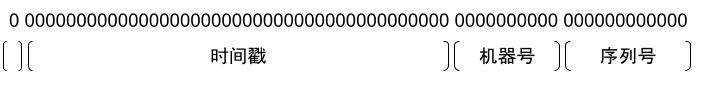
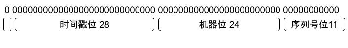

# 什么是 snowflake

snowflake 是 twitter 发布的一种分布式 ID 生成算法。它的优势有：

* 64 bits 的数字
* 具有递增趋势（但不连续，不适合做 MySQL 主键）
* 不依赖额外中间件
* 本地计算，高性能（但不代表可以无限生成）

那么它是如何做到的呢？

# snowflake 算法详解

* 计算中存储 64 位有符号整数，第一个 bits 是表示符号，因为我们只使用正整数，因此此位是固定的，且必为 0。以表示此数为证书
* 接下来是 41 bits的时间戳，因为采用时间戳并作为高位，因此随着时间的增长，整个 id 会呈现递增趋势。41 bits 最大为 `2^41 - 1 = 2199023255551` ,我们将其作为毫秒数，也就是说可以用差不多`69年`到 `70` 年。恐怕我们的 app 应该是活不了这么久了。
* 然后是有 10 bits的机器位，其中 5 bits 的数据中心 id和 5 bits的机器 id。可以最大分配到 `1023` 个节点。这里是硬的，需要手动为每个节点分配不重复的机器位。
* 最后是 12 bits 的递增序列号，可以生成 `2^12 - 1 = 4095` 个序列号

图示如下：


按照上面的计算方式，snowflake 可生成的 ID 数目在极端情况下可以达到： **每毫秒 `1023 * 4095 = 4189185` 个**。如果你觉得还不够，实际上我们还可以通过借用时间戳的方式生成更多的 ID。而且全程不依赖中间件，性能极高。

但是，实际上，按照这种方式不太适合在 k8s 上大规模部署，因为我们没有一个很好地方式去自动生成机器位，因为 Deployment 的配置总是被固定下来，然后被随意伸缩。如果 pod 间机器位相同会导致 ID 生成很可能会重复，因此我们需要一种方式去自动生成不重复的机器位，按照目前的方式大概只能通过中间件去做，大概思路是：

可以分配一个 1023 长度每个槽位为 0 的数组，一个新的实例进来遍历数组知道找到一个为 0 的槽位，变更为 1 并记录此槽位的 index 到内存中，实例被注销时需要去中间件将此槽位变更为 0 即可。这可以通过 Redis 等中间件去做。但是依赖中间件会带来很多新的问题：

* Redis 不可用会导致应用无法被分配 ID
* 需要确保应用启动和注销都一定能被执行

好在，snowflake 算法其实非常灵活，我们可以根据自己的想法进行调整，我们是否有一种方案能够实现不依赖中间件也能分配到唯一的机器位呢？

# snowflake 的优化

实际每台机器或者说一个 k8s pod 有一个很重要的唯一可利用的唯一地址，就是 IP。我们是否可以在这上面做文章呢？

一个 IP 固定为 32 位，由 4 个字节组成，我们在 k8s 中一般会采用 `/24` 的掩码，也就是说能保证第一个字节保持一致，剩下的 3 个字节会不一样，这有 24 位，仍然无法满足我们 10 个机器位的需求。

好在，鉴于 snowflake的灵活性，我们可以再调整其它长度。

* 41 位的时间戳确实太长了，我们可以将其缩短，绝大部分情况下，69 年太长了，我们可以缩短一下，进行多次简单的右移（也就是除以 2 ）。 `69 / 2 / 2 / 2 = 8.6` 年，应该足够我们使用了，这就省下来 3 位。另外我们不需要每毫秒生成那么多的 ID。因此我们可以采用**秒**为单位来生成，这能为我们省下来 `log2(1000) ≈ 10` bits。最终时间戳位可以缩减到 28 位。
* 通过时间戳的优化后，还差机器位距离 24 位 还差 1 位。可以通过借一位序列号位来实现。

最终生成结果如下:



在此设计下，可以说 snowflake 的 ID 生成数量大幅下滑了，可以总共使用 8.6 年，每个节点每秒可生成 `2 ^ 11 - 1 = 2047` 个 ID。但是它更适合 K8S。因为我们可以通过 Deployment 来分配 `16777215` 个实例了，也就是说极端情况下，可以每秒生成 `34342959105` 个 ID，虽然远不如原算法，但是通过大量的轻量级实例来取消对中间件的依赖，我觉得是值得的，中间件会加剧链路上的不确定性。

# snowflake 的 Go 实现

实际上 snowflake 算法是非常简单的，这里做一个简单的示例（抄下来直接可用）：

```go
package main

import (
	"fmt"
	"net"
	"strconv"
	"strings"
	"sync"
	"time"
)

var (
	Epoch int64 = 1631780048 //2021-09-16 16:14:08

	NodeBits uint8 = 24

	StepBits uint8 = 11

	mu          sync.Mutex
	epoch       time.Time
	currentTime int64
	node        int64
	step        int64

	stepMask  int64
	timeShift uint8
	nodeShift uint8
)

func init() {
	node = GetWorkerIdByIp()
	stepMask = -1 ^ (-1 << StepBits)
	timeShift = NodeBits + StepBits
	nodeShift = StepBits
	var curTime = time.Now()
	epoch = curTime.Add(time.Unix(Epoch, 0).Sub(curTime))
}

func Generate() int64 {
	mu.Lock()
	defer mu.Unlock()

	now := time.Since(epoch).Nanoseconds() / 1000000000

	if now == currentTime {
		step = (step + 1) & stepMask

		if step == 0 {
			for now <= currentTime {
				now = time.Since(epoch).Nanoseconds() / 1000000000
			}
		}
	} else {
		step = 0
	}

	currentTime = now
	return (now << timeShift) | (node << nodeShift) | step
}

func GetWorkerIdByIp() int64 {
	ip := GetLocalIP()
	if ip == "" {
		return 0
	}
	return ConvertToIntIP(ip)
}

func ConvertToIntIP(ip string) int64 {
	ips := strings.Split(ip, ".")
	if len(ips) != 4 {
		return 0
	}
	var intIP int
	for k, v := range ips[1:] {
		i, err := strconv.Atoi(v)
		if err != nil || i > 255 {
			return 0
		}
		intIP = intIP | i<<uint(8*(2-k))
	}
	return int64(intIP)
}

func GetLocalIP() string {
	addrs, err := net.InterfaceAddrs()
	if err != nil {
		return ""
	}
	for _, address := range addrs {
		if ipnet, ok := address.(*net.IPNet); ok && !ipnet.IP.IsLoopback() {
			if ipnet.IP.To4() != nil {
				return ipnet.IP.String()
			}
		}
	}
	return ""
}

func main() {
	fmt.Println(Generate())
}

```

# snowflake 的一些思考

* 其实 snowflake 实在不是什么高深的算法，也不过是在拼接时间戳，不过它的思路还是非常有趣的，在 snowflake 之前，一般我们都是直接字符串拼接，导致生成的 ID 长度太长只能作为字符串传递。

> 讲个笑话，很久看同事的一段代码，我始终也没想明白他直接字符串拼接，例如 `2020年1月2号11点16分34秒234毫秒` 直接把数字拿出来然后直接拼接上一个机器号数字再加上一个序列号，注意都是字符串拼接，最终生成一个很长的字符串 ID。确实能保证唯一，但是，他居然把这个类命名为 `Snowflake`，我？？？满头问号。。。看起来是学东西只学了一半。。。

* snowflake 算法非常灵活，其实可以根据应用进行调整的，不要被限制死了，例如如果机器比较少，可以直接机器位设置为一到两位，然后按需缩减其它的位数，可以显著减小数字大小。

* 如果你需要一个生成短字符串唯一 ID 生成算法，其实也是可以利用 snowflake 的，可以将生成 snowflake 进行 62 进制转换，生成 `[0-9a-zA-Z]` 组成的字符串序列，事实上我们的业务就有使用这种方式来生成唯一的 KEY。以下是代码示例：

```go
// 字典可以打乱的
var dict string = "ohrfjdgPzp3T2XkNulQBFas9eJDmW7VKSC51cbUL8tRiOqIwZn406YEMyGxHAv"
func From10To62(num int64) string {
	var str62 []byte
	for {
		var result byte

		number := num % 62
		result = dict[number]

		str62 = append([]byte{result}, str62...)
		num = num / 62

		if num == 0 {
			break
		}
	}
	return string(str62)
}
```

生成的 Key 大概是这样子：`hQnT0wuETI`。还是非常方便的。

* 完全不依赖任何中间件的唯一 ID 生成，真的很爽！！！