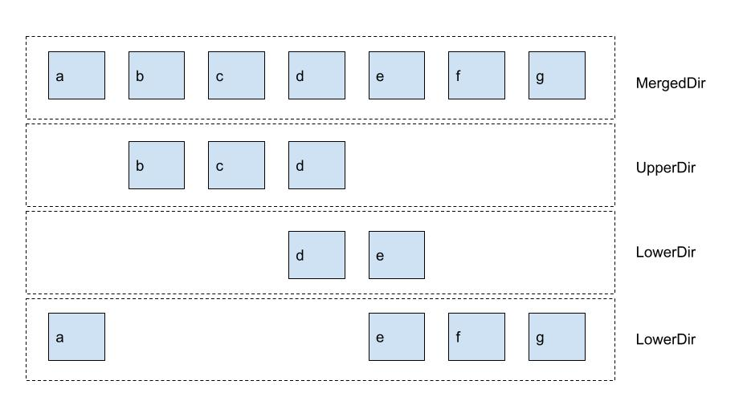
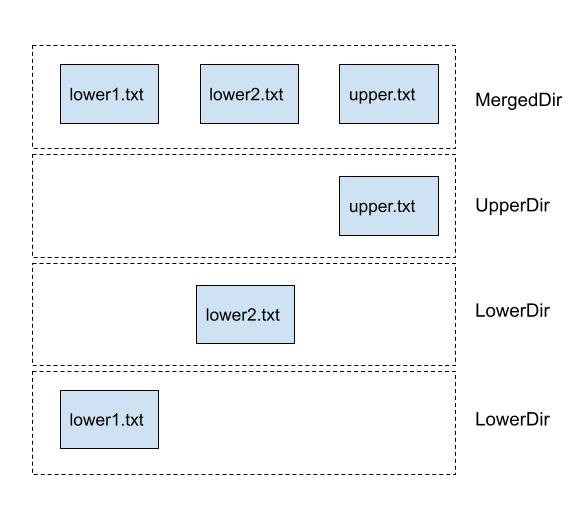

# 什么是 overlayfs

如果你使用过 Docker，可能听过 aufs，与之一样，overlayfs 也是一个用于为 Linux 文件系统实现联合挂载的一种文件系统。它的核心概念是**堆叠**，把多个文件夹按照次序堆叠起来。

不知道你有没有遇到过需要合并文件夹的场景，如果你之前没有接触过类似的文件系统，那么你应该是通过 拷贝 覆盖来完成的。



overlayfs 的特点：
* 上层文件优先
* 挂载合并零拷贝
* 底层文件系统只读

我们合并多个文件夹，就按照 Upper -> Lower 的次序一次堆叠起来，最终用户看到的就是 MergedDir。从上到下，用户只能看到最上层的文件，而无法越过它。这就是实现了一种类似文件夹合并的策略。用一句话理解就是 **上层文件优先**。

它是**零拷贝**的，它的速度非常快，只需要执行一次 `mount` 操作就能实现。

另外，你可能注意到了，在用户看到的最终文件系统层下，有一个 `UpperDir`，这是你在此文件系统中唯一可以操作变动的层，你的所有 增加、修改、删除 操作都是在这一层上完成的，不会有任何记录留在 `LowerDir` 中，这可以保证你的操作不会污染到原文件夹，即使你看起来是删除的是来自于 `LowerDir` 的文件。

# 如何使用

挂载 overlayfs 的基本命令如下：
```shell
mount -t overlay overlay -o lowerdir=lower1:lower2:lower3,upperdir=upper,workdir=work merged
```
lower1:lower2:lower3是指定lower层的目录，越前面越优先，lower1>lower2>lower3。这里需要注意，lower层可以指定非常多，但是在 overlay1 版本中，最多支持 128 层，在 overlayfs2 中添加了更多层的支持。

使用 overlayfs 非常的简单:

```shell
# mkdir lower1
# mkdir lower2
# mkdir upper
# mkdir worker
# mkdir merged
# touch lower1/lower1.txt
# touch lower2/lower2.txt
# touch upper/upper.txt
```

* lower1、lower2、upper 三个文件夹，这个三个文件夹是用来合并的
* 一个空的 worker 文件夹，这文件夹不能有任何内容
* 最后需要一个 merged 文件夹，用来作为给用户呈现的最终文件夹

> worker 文件夹是一个空文件夹，它是作为中间临时文件夹而存在，需要和 upperdir 是**同一个文件系统**。

它最终展示的效果应该是这样:


接下来实操一次：

```shell
# mount -t overlay overlay -olowerdir=./lower1:./lower2,upperdir=./upper,workdir=./worker ./merged
```

通过 ls 命令看一下：

```shell
# ls ./merged/
lower1.txt  lower2.txt  upper.txt
```

表现一直，非常完美。接下来我们可以尝试一下增加删除修改

## 增加文件

```shell
# touch ./merged/merged.txt
# ls ./merged/
lower1.txt  lower2.txt  merged.txt  upper.txt
# ls ./upper/
merged.txt  upper.txt
```
可以看到，增加文件是直接添加到了 upper 文件夹中，

## 删除文件

```shell
# rm -f ./merged/lower1.txt
# ls ./merged/
lower2.txt  merged.txt  upper.txt
# ls ./lower1/
lower1.txt
```

可以看到，删除文件之后，下面的 lower 文件夹里的内容并没有被真正的删除，但是上面的 merged 文件夹表现是确实已经被删除了。

我们可以直接去查看 `upper` 文件夹下面的内容：

```shell
# ls -al ./upper/
总用量 8
drwxr-xr-x 2 root root 4096 9月  26 19:13 .
drwxr-xr-x 7 root root 4096 9月  26 18:55 ..
c--------- 1 root root 0, 0 9月  26 19:13 lower1.txt
-rw-r--r-- 1 root root    0 9月  26 19:10 merged.txt
-rw-r--r-- 1 root root    0 9月  26 18:56 upper.txt
```

多了一个 c 类型的文件，名字刚好为 lower1.txt，它表示此文件已经被删除了，会将下层的该文件直接忽略。

## 修改文件

```shell
# echo 'hello' > ./merged/lower2.txt
# cat ./merged/lower2.txt
hello
# ls -al ./upper/
总用量 12
drwxr-xr-x 2 root root 4096 9月  26 19:13 .
drwxr-xr-x 7 root root 4096 9月  26 19:16 ..
c--------- 1 root root 0, 0 9月  26 19:13 lower1.txt
-rw-r--r-- 1 root root    6 9月  26 19:17 lower2.txt
-rw-r--r-- 1 root root    0 9月  26 19:10 merged.txt
-rw-r--r-- 1 root root    0 9月  26 18:56 upper.txt
# cat ./lower2/lower2.txt
```

当文件修改后，我们查看上层的 upper 文件夹，会发现，多了一个 lower2.txt。而底层的 lower2.txt 仍然没有内容变化。依此可以推断出，其实修改文件是将下层的文件复制到上层来之后再进行修改的。

好了，overlay 的使用非常简单，接下来我们来聊聊它的实现原理。

# 实现原理

overlayfs 最开始并不是作为 Linux 内核实现的，而是在成熟之后，于 Linux 内核 3.18 版本才合并进来的。

通过上面的操作，其实可以大概推断出来了。首先，需要一套规则，能够实现**上层文件优先**。这个能力非常的简单：

当查找目录时，如果一个名称在多个层中存在：
  * 如果是文件，则优先级高的文件是可见的，而优先级低的层此文件将被隐藏。
  * 如果是目录，则合并中所有内容（如果内部文件名相同参考上一条）。

添加文件非常的简单，只需要在 upper 上添加就行。

删除文件或文件夹时，会在 upper 中添加一个同名的 `c` 标示的文件，这个文件叫 `whiteout` 文件。当扫描到此文件时，会忽略此文件名。

此时又会产生一个特殊情况，如果删除文件，再新增此文件，只覆盖 `whiteout` 文件即可，这没有问题，但是如果是删除一个文件夹，又再新增此文件夹，如果只覆盖 `whiteout`。则底层目录里的原文件又会被显示出来，这显然是不可接受的，为此，引入了一个新的属性，叫 `Opaque`。
```shell
# mkdir ./lower1/lower1dir
# ls ./merged/
lower1dir  lower2.txt  merged.txt  upper.txt
# rm -rf ./merged/lower1dir/
# ls -al ./upper/
总用量 12
drwxr-xr-x 2 root root 4096 9月  26 19:44 .
drwxr-xr-x 7 root root 4096 9月  26 19:16 ..
c--------- 1 root root 0, 0 9月  26 19:44 lower1dir
c--------- 1 root root 0, 0 9月  26 19:13 lower1.txt
-rw-r--r-- 1 root root    6 9月  26 19:17 lower2.txt
-rw-r--r-- 1 root root    0 9月  26 19:10 merged.txt
-rw-r--r-- 1 root root    0 9月  26 18:56 upper.txt
# mkdir ./merged/lower1dir
# ls -al ./upper/
总用量 16
drwxr-xr-x 3 root root 4096 9月  26 19:48 .
drwxr-xr-x 7 root root 4096 9月  26 19:16 ..
drwxr-xr-x 2 root root 4096 9月  26 19:48 lower1dir
c--------- 1 root root 0, 0 9月  26 19:13 lower1.txt
-rw-r--r-- 1 root root    6 9月  26 19:17 lower2.txt
-rw-r--r-- 1 root root    0 9月  26 19:10 merged.txt
-rw-r--r-- 1 root root    0 9月  26 18:56 upper.txt
# getfattr -n "trusted.overlay.opaque" ./upper/lower1dir
trusted.overlay.opaque="y"
```
> getfattr 指令在centos/debian下可以通过安装 attr 包来使用。

可以看到增加了一个 `trusted.overlay.opaque` 属性。它表示这是一个当前层的目录，需要隐藏下层的内容。而为了支持修改这个属性，就需要 upper 层所在的文件系统支持 xattr 扩展属性。

修改文件内容时，实际上就是将文件复制到 upper 层再进行写入，这就是**写时复制**的特性，不仅是内容，事实上你对文件的任何修改，例如`rename`、修改属性、带写方式打开文件、修改权限等等，都会导致文件发生复制。

# 总结

overlayfs 被广泛用于容器中，例如镜像构建，容器运行，都会用到相应的技术。你可以在服务器上执行 `mount -t overlay ` 看到所有你挂载的容器所在使用的文件系统，

你应该了解它，它可以被用作容器，也可以用来做非常多的事情，技术无价，只有你想不到，没有你做不到。