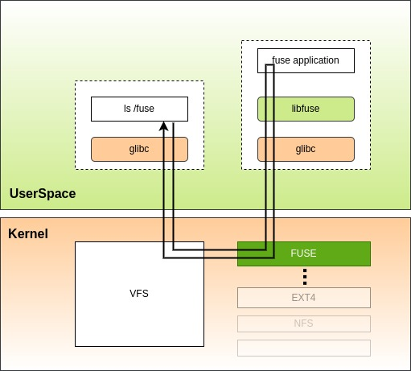

2021-11-27-filesystem-in-user-space

---
title: 用户态文件系统笔记
createdDate: "2021-11-27"
updatedDate: "2021-11-27"
tags:
  - fuse
  - containers
origin: true
draft: false
---

# 用户态文件系统介绍

FUSE (用户空间中的文件系统)是用户空间程序将文件系统导出到 Linux 内核的接口。FUSE 项目由两个组件组成：FUSE 内核模块(在常规内核存储库中维护)和用户空间库([libfuse](https://github.com/libfuse/libfuse))。

> [libfuse](https://github.com/libfuse/libfuse) 也只是建议的参考实现，你也可以自行实现，这与语言无关。

## 为什么一定要是**用户态**

* 当处于用户态时，首当其冲的好处就是，不再需要使用 root 用户去 mount 文件系统了，如果你是非系统管理员，也能够去 mount 一个指定的虚拟文件系统。这催生了著名的 [fuse-overlayfs](https://github.com/containers/fuse-overlayfs)，其在 rootless 容器化中扮演重要的角色，事实上 docker 当年一定要 root 守护进程的一个重要原因就是没有合适的用户态堆叠文件系统，导致架构不得不妥协，甚至导致后续严重的安全隐患，再后来随着用户态文件系统的发展，docker 19.03 才终于实验性地支持 rootless 模式了！！
* 其次，你不再需要去修改内核就能实现一个文件系统，完全发挥你的想象，例如非常著名的 [sshfs](https://github.com/libfuse/sshfs)，只要能连接 ssh ，你就能直接挂载一个远程的文件系统。

## 用户态文件系统并不那么**用户态**

用户态文件系统并不那么的用户态，因为你的代码并不是真正在用户态去访问文件系统，它其实只是一层代理，当调用文件系统时，最先进去的仍然是 VFS,真正的文件 IO 操作最终还是由内核实现，而在用户态能做的，是作为一个守护进程，将内核传递的 fuse request 经由用户态进行处理，再调用 vfs 让内核去写数据。结构图如下：



但是这样的设计对于用户开发是有极大好处的：

* 用户无需关心文件系统底层细节，只需与 VFS 交互即可实现一个文件系统。
* 用户态崩溃不会影响到内核。
* 你只需要遵循协议，可以使用任意语言实现。

# fuse 基本原理

FUSE 模块其实是一个简单的客户端-服务器协议，它的客户端是内核，用户态的守护进程就是服务端，内核模块会通过 vfs 暴露一个 /dev/fuse 的设备文件：
```shell
$ ls -l /dev/fuse
crw-rw-rw- root root 0 B Thu Nov 18 22:24:32 2021 /dev/fuse
```

这即是我们与 FUSE 内核模块交流的纽带。在我们的用户空间代码中，通过调用 open 函数获得文件描述符，凭此来读取请求并且写入响应来完成一次 IO 调用。不过需要注意的是，这个设备每次打开都会有一个不同的 session,第二次调用 open 的时候并不能访问到第一次调用 open 的资源。

## fuse 协议

既然是客户端-服务器协议，那么与 http 协议一样，每一个从内核到用户空间的请求也都有一个请求头 fuse_in_header，它的大小是固定的，定义如下：
```c
struct fuse_in_header {
	uint32_t	len; /* 数据长度：包括 header 在内 */
	uint32_t	opcode; /* 操作码*/
	uint64_t	unique; /* 唯一请求 id */
	uint64_t	nodeid; /* 被操作的文件系统对象（文件或目录）的 ID */
	uint32_t	uid; /* 请求进程的 uid */
	uint32_t	gid; /* 请求进程的 gid */
	uint32_t	pid; /* 请求进程的 pid */
	uint32_t	padding;
};
```

这在 [内核的 fuse.h](https://git.kernel.org/pub/scm/linux/kernel/git/torvalds/linux.git/tree/include/uapi/linux/fuse.h) 头文件和 [libfuse 下的 fuse_kernel.h](https://github.com/libfuse/libfuse/blob/master/include/fuse_kernel.h)中都有定义。

接着在请求头之后，则紧跟着请求体，请求体的长度是可变的，它的具体类型可以通过 opcode 来进行判断，它表示了操作的类型，主要就凭借它来识别内核到底想要干嘛，你应该回复什么消息，所有的 opcode 在 libfuse 中均有 [定义](https://github.com/libfuse/libfuse/blob/fuse-3.10.5/include/fuse_kernel.h#L379-L428)。

例如，如果 opcode 为 15 (FUSE_READ)，则后面紧跟着 `fuse_read_in` 结构体。不过为了更详细的讲解，我们拿一个更全面的 rename 操作来说明。rename 的 buf 结构长这样 `{fuse_in_header}{fuse_rename_in}{oldname}{newname}`。它的解析过程略有意思:

1. 读取 header，直接读取 fuse_in_header，类似这样： `struct fuse_in_header *in = (struct fuse_in_header *) buf;`
2. 判断 opcode 为 15，接下来读取 fuse_rename_in 类似这样： `buf += sizeof(struct fuse_in_header);struct fuse_rename_in *arg = (struct fuse_read_in *) buf;`
3. 除此之外，它的结构还跟着 oldname 和 newname，分别这样读取 `char* oldname = (((char*)buf) + sizeof(*buf));char* newname = oldname + strlen(oldname) + 1;`

通过以上步骤，我们就完成了数据的读取，很多的 opcode 都有自己独特的读取方式，这个还是要根据 [fuse.4](https://man7.org/linux/man-pages/man4/fuse.4.html) 文档中的来，我这里只做了一点示例。

读取完请求之后，我们就需要做相应的处理然后写入请求了。如果我们只是简单的代理文件夹，那么可以就可以直接调用系统的 rename 函数了，因此，这里的处理函数就只需要这样就可以啦：

```c
#include <fcntl.h>
#include <stdio.h>

void handle(void *buf) {
  struct fuse_in_header *in = (struct fuse_in_header *) buf;
  if in.opcode == 15 {
    buf += sizeof(struct fuse_in_header);
	  struct fuse_rename_in *arg = (struct fuse_rename_in *) buf;
    char* oldname = (((char*)buf) + sizeof(*buf));
    char* newname = oldname + strlen(oldname) + 1;
    //这一句才是实际处理，而 renameat 又调回了内核,因此你仍然无法接触任何内核的东西。但是你可以实现你自己的其他逻辑。
    //当然实际情况一般都是代理其他文件夹，所以这里不可能这么写，只是做一个示例。
    renameat(req, fuse_in_header->nodeid, oldname, arg->newdir, newname, 0);
  }
}

```

这样就基本实现一个改名函数啦，当然了，上面实现了请求消息解析，但是还缺少写入响应，所以内核还并不知道你处理的结果是怎样的。

fuse 协议的相应头叫 `fuse_out_header` ，长这样：

```c
struct fuse_out_header {
	uint32_t	len;
	int32_t		error;
	uint64_t	unique;
};
```

它包含一个错误码和一个跟请求保持一致的唯一 id，用于标识是哪个请求的响应。接着在之后紧跟着响应体（如果有）。如果错误码不为 0，则不应该包含响应体。具体怎么写其实和req 的读取类似，就不再赘述了。

# 用户态文件系统库生态

上面讲述的也只是基本协议，其实用户态文件系统还需要涉及到很多方方面面，因此选择一个好的实现就很重要了，目前 fuse 的生态基本各语言都有封装。

首选的当然是用户态 FUSE 协议的参考实现 libfuse 了，它通过封装对外提供了两类 API 以帮助我们快速开发，分别是:
* [fuse_lowlevel.h](https://github.com/libfuse/libfuse/blob/master/include/fuse_lowlevel.h) ，它是内核调用的浅封装转发，可控性更高，性能更好，但是需要对源码以及文件系统机制有一定了解。
* [fuse.h](https://github.com/libfuse/libfuse/blob/master/include/fuse.h)，它是 lowlevel api 的再封装，基本屏蔽了大部分复杂性，只需要实现一部分 api 即可实现一个用户态文件系统，但是性能表现一般。大部分应用都不会选择使用 high level api 进行开发，毕竟用户态文件系统性能非常关键。

其次就是 go 语言的 [go-fuse](https://github.com/hanwen/go-fuse) ，以及 rust 语言的 [fuse-rs](https://github.com/zargony/fuse-rs)，不过已经有一段时间没更新了，更推荐 [fuser](https://github.com/cberner/fuser) 这个库，它是 fuse-rs 的一个 fork ，目前在持续更新中。

# 总结

FUSE 是云原生与容器化的一个重要模块，就如开头说的，它几乎是实现 rootless 文件系统的唯一选择，由此发展了 fuse-overlayfs 。而对于我们普通开发者而言，我们也可以通过用户态文件系统来扩展自己想要的功能。
